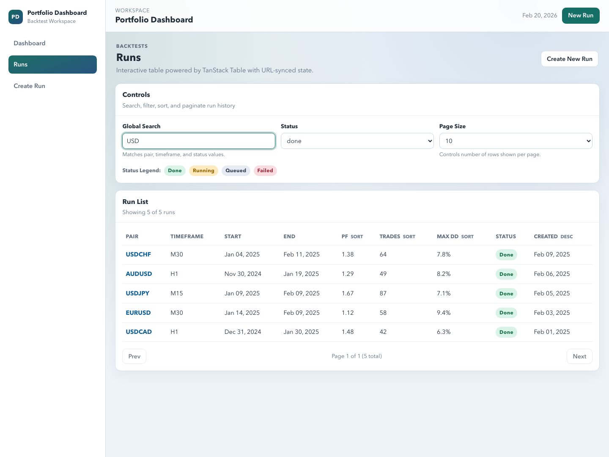
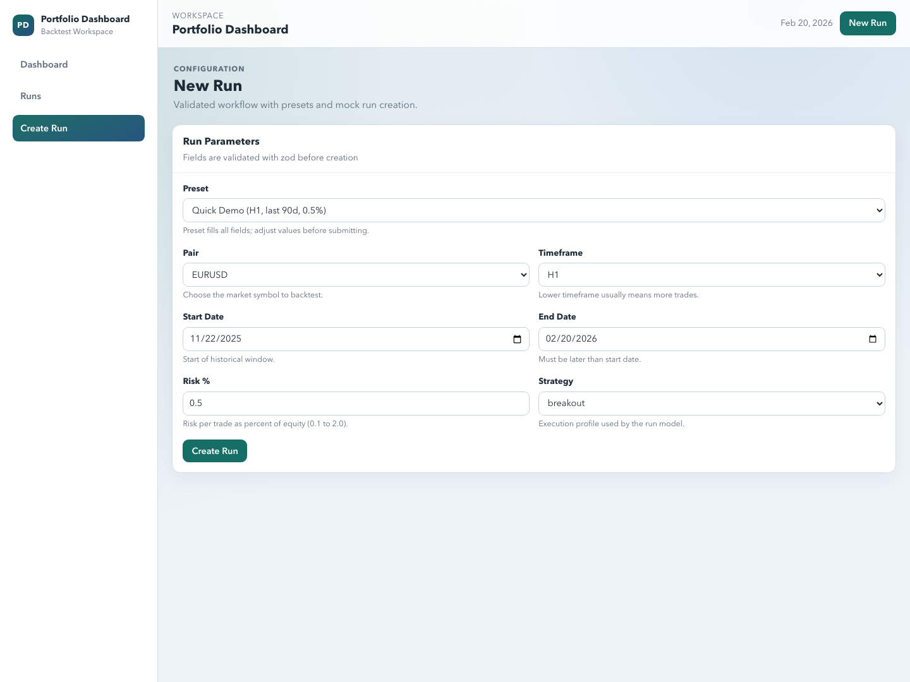
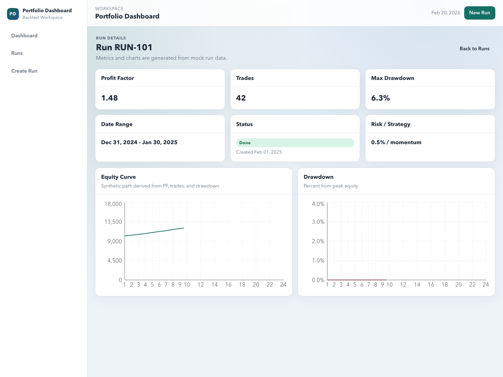

# Portfolio Dashboard

Live Demo: https://portfoliodashboardproject.netlify.app
GitHub: https://github.com/DevCalebR/portfolio-dashboard

Project summary: Portfolio Dashboard is a Vite + React + TypeScript SPA for backtest research workflows. It combines URL-synced run exploration, validated run creation, and chart-based run analysis in a clean, accessible interface.

## Key Features

- URL-synced runs table state with global search, status filter, sorting, and pagination.
- Interactive runs workflow with loading, empty, and error states plus retry handling.
- Validated New Run form using React Hook Form + Zod, including reusable presets.
- Run detail metrics with lazily loaded chart components for code-split performance.
- Accessibility improvements including visible focus states and keyboard-friendly navigation.
- Lightweight Node-based tests and production build checks via `npm test` and `npm run build`.

## Screenshots

### Runs Table



### New Run Form



### Run Detail



## Tech Stack

- Vite
- React
- TypeScript
- TanStack Table
- React Hook Form
- Zod
- Recharts
- React Router

## Getting Started

### 1. Install

```bash
npm install
```

### 2. Run dev server

```bash
npm run dev
```

### 3. Build

```bash
npm run build
```

### 4. Run quality checks

```bash
npm run lint
npm run typecheck
npm test
```

## Deploy to Netlify

Use these Netlify settings:
- Build command: `npm run build`
- Publish directory: `dist`
- Node version: `20+`

SPA routing is configured via `public/_redirects` with:

```text
/* /index.html 200
```

That file is copied into `dist/_redirects` during build so direct route visits (for example `/runs/123`) resolve correctly on Netlify.

## Project Structure

```text
src/
  app/
    router.tsx
    RouteLoadingState.tsx
  components/
    layout/
      AppLayout.tsx
      SideNav.tsx
      TopNav.tsx
    ui/
      Badge.tsx
      Button.tsx
      Card.tsx
      Input.tsx
      Select.tsx
  features/
    runs/
      components/
        RunDetailCharts.tsx
      mockApi.ts
      mockData.ts
      queryState.ts
      types.ts
  lib/
    format.ts
  pages/
    DashboardPage.tsx
    RunsPage.tsx
    NewRunPage.tsx
    RunDetailPage.tsx
    NotFoundPage.tsx
scripts/
  run-tests.mjs
docs/
  screenshots/
```

## Testing Notes

`npm test` runs a lightweight Node script (no extra test framework) that validates:
- `listRuns` filtering/sorting/pagination behavior.
- URL query parsing sanitizes invalid params to defaults.

## Performance Notes

Route-level lazy loading is enabled and the heavy run-detail chart module is split into its own chunk.

## Roadmap

- Server/API integration for runs and analytics.
- Debounced search and richer column filters.
- More chart drill-downs and benchmark overlays.
- End-to-end tests for critical flows.
