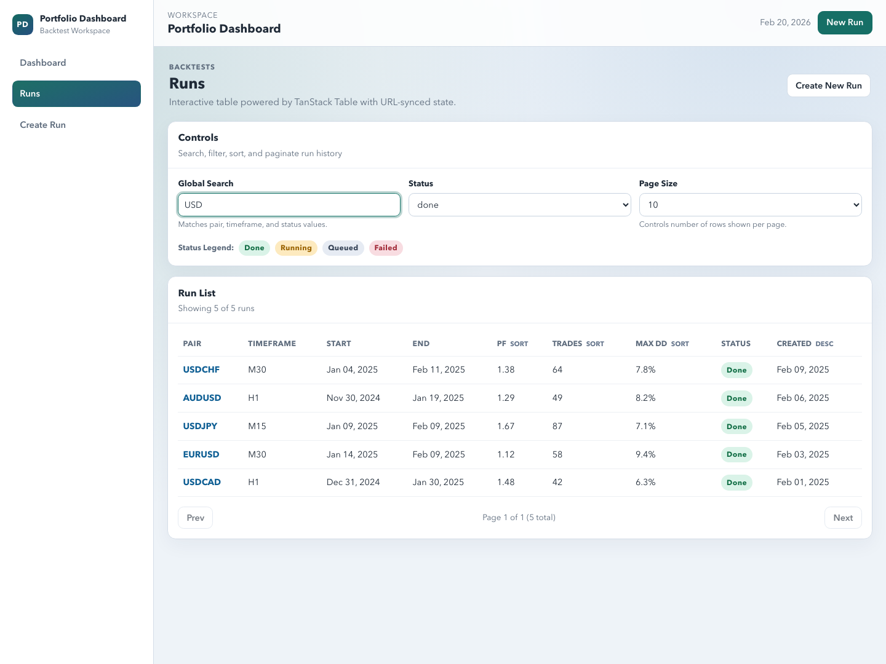
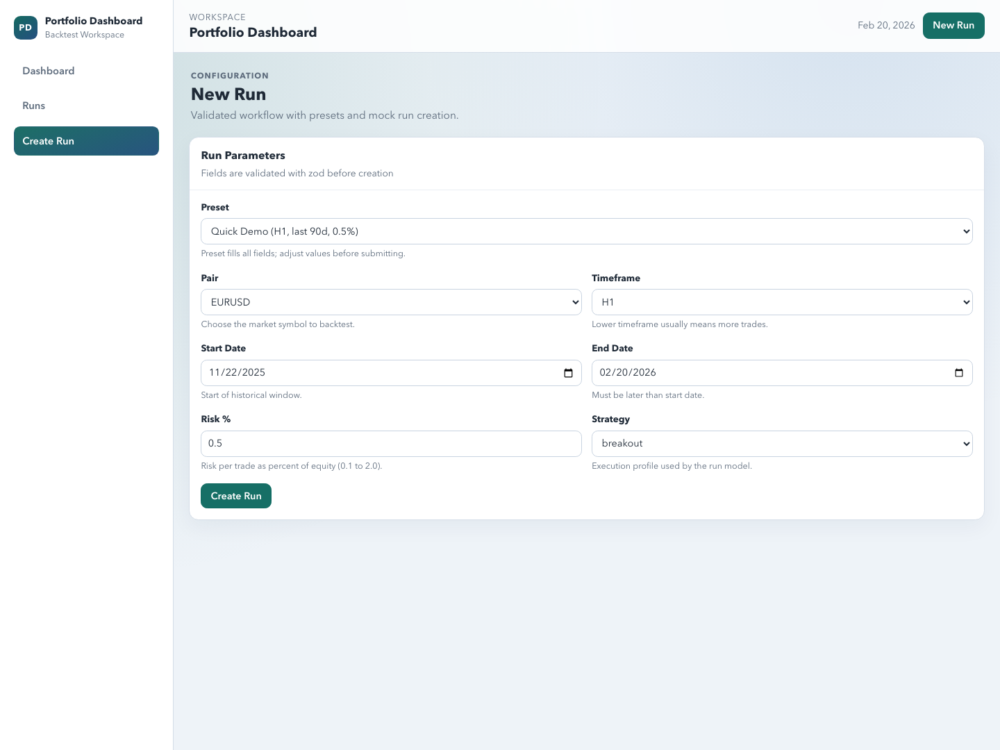
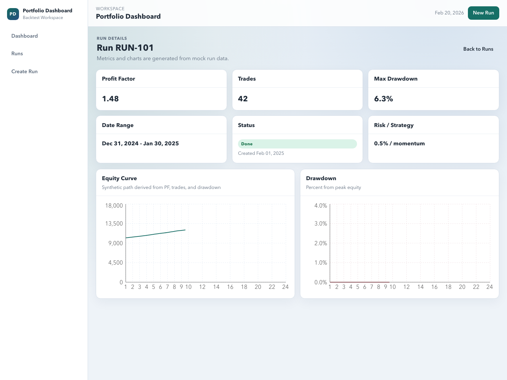
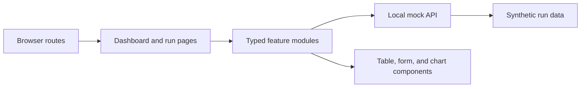

# Portfolio Dashboard

A responsive React and TypeScript frontend for browsing synthetic backtest runs, configuring new runs, and reviewing metrics and charts through a local mock data layer.

> Portfolio status: frontend demonstration. The repository does not include a live trading system, broker integration, analytics backend, authentication, or persistent database.

## What it demonstrates

- URL-synchronized search, status, sorting, and pagination state
- Responsive run table built with TanStack Table
- Validated run-configuration flow using React Hook Form and Zod
- Run detail pages with lazy-loaded Recharts visualizations
- Accessible keyboard navigation, visible focus states, and route-level error handling
- Typed mock-service boundaries that can be replaced by a real API client
- CI-friendly lint, typecheck, test, build, and smoke commands

## Screenshots

| Run tracking | Run configuration |
| --- | --- |
|  |  |



All values and charts shown in these captures are synthetic. New runs exist only for the current browser session.

## Technology stack

- React 19 and TypeScript
- Vite
- React Router
- TanStack Table
- React Hook Form and Zod
- Recharts
- ESLint and lightweight Node-based behavior tests

## Architecture


```mermaid
flowchart LR
    U[Browser routes] --> P[Dashboard and run pages]
    P --> F[Typed feature modules]
    F --> M[Local mock API]
    M --> D[Synthetic run data]
    F --> C[Table, form, and chart components]
```

The page-level interfaces depend on typed feature contracts rather than importing fixture data directly. A real backend can replace the mock API while preserving the existing route and component boundaries.

## Run locally

Prerequisites: Node.js 20+ and npm 10+.

```bash
git clone https://github.com/DevCalebR/portfolio-dashboard.git
cd portfolio-dashboard
npm ci
cp .env.example .env.local
npm run dev
```

The environment file controls display branding only; no secrets or provider credentials are required.

## Validation

Run the complete release check:

```bash
npm run deploy:check
```

This executes lint, TypeScript checks, behavior tests, the production build, and a generated-output smoke test.

## Project structure

```text
src/app/              Router loading and error states
src/components/       Shared presentation components
src/config/           Display configuration
src/features/runs/    Run contracts, mock service, table, forms, and charts
src/pages/            Dashboard, list, creation, and detail routes
docs/screenshots/     Authentic local application captures
scripts/              Test, setup, and build-output smoke checks
```

## Known limitations

- The mock API does not persist data across browser sessions.
- Charts and performance values are synthetic and are not financial results.
- There is no live broker, market-data feed, job runner, backend API, database, or authentication.
- The previously published demo URL is unavailable; evaluate the project locally from this repository.

## License and terms

See [LICENSE](LICENSE) and [TEMPLATE_USAGE_TERMS.md](TEMPLATE_USAGE_TERMS.md). Repository availability does not imply that performance claims or financial advice are being offered.

## Related work

Review more API integration, automation, and dashboard projects on the [DevCalebR GitHub profile](https://github.com/DevCalebR) or the [RelayWorks portfolio](https://getrelayworks.com/work/).
